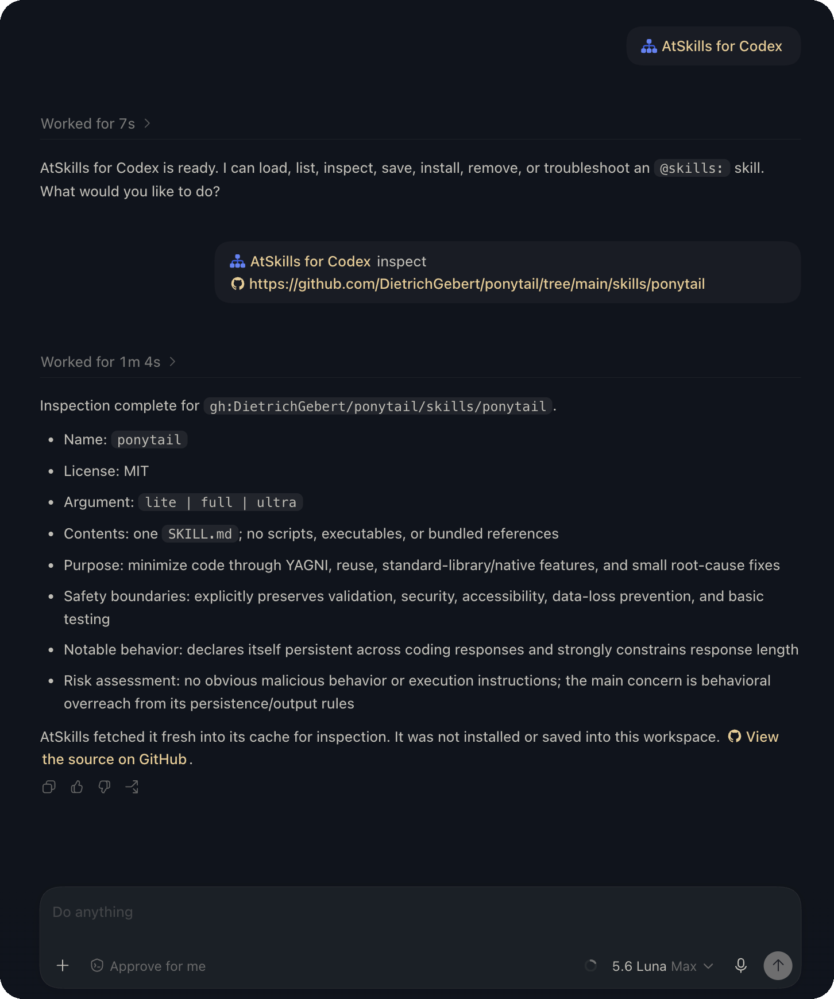

# @skills for Codex

`atskills-codex` lets Codex load local or GitHub-hosted skills on demand with
`@skills:` references.

## Why use it?

- **Less context overhead:** skill instructions load when referenced instead of all at once.
- **Explicit workflows:** name the exact skill you want Codex to use.
- **Reusable skills:** keep one `SKILL.md` and use it across workspaces.
- **Local or GitHub-hosted:** use skills from your workspace or a public repository.
- **Safer by default:** resolved skill files are treated as instructions; bundled scripts are not executed automatically.

## See it in action

<p align="center">
  
</p>

[Open the interactive diagrams on GitHub Pages →](https://nicholasvuono.github.io/atskills-codex/)

## Quick setup

Requirements: the Codex CLI, Node.js 20+, and Git for GitHub-hosted skills.

Install the plugin:

```sh
codex plugin marketplace add nicholasvuono/atskills-codex --ref main
codex plugin add atskills-codex@atskills-local
```

Start a new Codex task, open `/hooks`, and review/trust the `atskills-codex`
hooks when prompted.

## Use a GitHub-hosted skill

Reference the directory that contains the skill’s `SKILL.md`:

```text
Use @skills:gh:OWNER/REPOSITORY/PATH to help with this task.
```

Example:

```text
Use @skills:gh:SylphAI-Inc/atskills/examples/simple-tdd.
```

## Use a local skill

Local skills live in the workspace where Codex is running. They are not part of
the installed plugin and are not global: a skill in
`/path/to/project/.atskills/` is available to that project, not automatically
to your other workspaces. The `.atskills/` directory is workspace state and is
ignored by Git by default, so use a GitHub reference when a team should share a
skill.

Copy a skill into `.atskills/<name>/` so the directory contains `SKILL.md`:

```sh
mkdir -p .atskills/my-skill
cp -R /path/to/my-skill/. .atskills/my-skill/
```

Then reference it by name:

```text
Use @skills:my-skill to help with this task.
```

List skills available in the current workspace:

```text
Use $atskills to list the available skills.
```

## Manage skills with `$atskills`

Ask Codex to manage the workspace-local skill state:

```text
Use $atskills to inspect @skills:gh:OWNER/REPOSITORY/PATH.
Use $atskills to save @skills:gh:OWNER/REPOSITORY/PATH for reuse in this workspace.
Use $atskills to install @skills:gh:OWNER/REPOSITORY/PATH as an automatic trigger.
Use $atskills to show the workspace's automatic skill triggers.
Use $atskills to show the provenance of @skills:my-skill.
Use $atskills to uninstall @skills:my-skill from automatic triggers.
Use $atskills to remove the saved local copy of @skills:my-skill.
```

`save` keeps a detached copy under `.atskills/`. `install` adds an entry to
`.atskills/.autotrigger` for automatic routing; it does not necessarily save a
copy. `uninstall` removes that automatic entry but keeps a saved copy. Removing
a saved copy requires explicit confirmation.

## More information

- [Install, update, remove, and troubleshoot](Integration.md)
- [CLI command reference](plugins/atskills-codex/skills/atskills/references/cli.md)
- [Release and maintenance notes](RELEASE.md)
