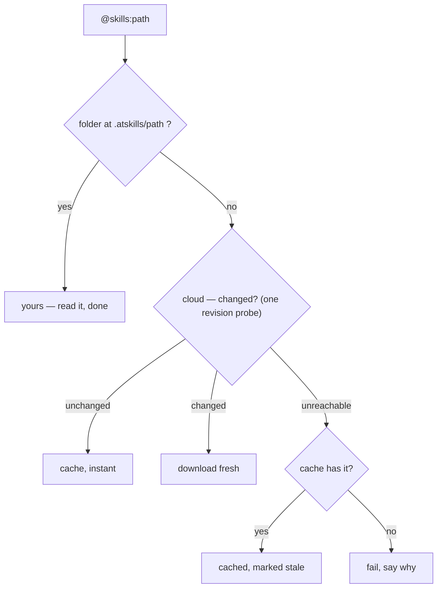

# The `@skills:` Protocol — Technical Specification

**Status**: stable. This document is the source of truth for implementers: the directory format, the addressing grammar, resolution, save, and auto-trigger semantics. The agent-facing form of the same rules is [`SKILLS.md`](./SKILLS.md); the executable form is [`tests/`](./tests/README.md). The protocol is purely a filesystem plus git — there is no manifest, no lockfile, and no registry dependency anywhere below.

## 1. What a Skill Is

A skill is a **directory**, not a single file. `SKILL.md` is the required entrypoint; everything else is optional supporting material:

```
my-skill/
  SKILL.md              # Required — the instructions (YAML frontmatter + markdown body)
  scripts/              # Optional — helper scripts the agent can execute
  references/           # Optional — reference docs, examples, lookup data
  templates/            # Optional — boilerplate files the agent may copy/fill in
```

Many skills are just a `SKILL.md` — that is a complete skill. A skill directory is format-identical to a Claude Code / Cursor / skills.sh skill directory: same shape, different delivery lifecycle (`README.md` → "How this relates to installed skills").

**The leaf rule.** A folder holding `SKILL.md` is a skill, and any tree walk **stops there**: a `SKILL.md` nested deeper inside a skill's bundle is that bundle's file, not a second skill. A directory *without* a `SKILL.md` is not an error — it is a **collection**: an index of the skills beneath it, one line per skill, every line itself a valid address.

## 2. Wire Format: SKILL.md

`SKILL.md` is a single UTF-8 text file: an optional YAML frontmatter block delimited by `---` lines, then a markdown body — the instructions given to the agent.

```markdown
---
name: tdd
description: Test-driven development methodology
author: mattpocock
version: 1.0.0
tags: [testing, methodology]
---

# TDD

1. Write a failing test FIRST
2. Write the minimum code to make it pass
3. Refactor only when green
```

### Frontmatter fields

| Field | Required | Type | Description |
|-------|----------|------|-------------|
| `name` | Yes | string | Identifier. Lowercase, hyphenated (e.g. `tdd`, `code-review`). |
| `description` | Yes | string | One-line summary shown in menus and the auto-trigger index. It is the trigger signal — keep it under ~120 chars and meaningful without the body. |
| `author` | No | string | GitHub username or handle. |
| `version` | No | string (semver) | Version of the content. Defaults to unset/latest. |
| `tags` | No | string[] | Free-form tags for discovery/filtering. |

Unknown frontmatter fields MUST be ignored by consumers (forward compatibility) — never rejected. `name` + `description` are the only fields that become **resident** when a skill auto-triggers (§7) — the body loads on demand.

A skill whose frontmatter lacks `name` or `description` cannot feed the auto-trigger index; a conforming client MUST refuse to `:install` it loudly rather than write a line that silently loads nothing.

### Body

Everything after the closing `---` is free-form markdown — instructions an agent can follow. Code blocks, tables, and Mermaid diagrams are all valid.

## 3. Supporting Directories

| Directory | Purpose | Consumed by |
|-----------|---------|-------------|
| `scripts/` | Executable helpers the agent can run | Agents with shell access |
| `references/` | Reference docs, examples, lookup tables | Agents with file-read access |
| `templates/` | Boilerplate the agent copies or fills in | Agents with file-write access |

None are required. A resolved skill is just files on disk, so agents that load skills their own way (`--skill` flags, native folders) consume the same directories untouched.

## 4. Addressing — the path is the identity

```
@skills:gh:<owner>/<repo>/<path>     GitHub — any public repo, no packaging step
@skills:<owner>/<name>               hub — ships later (§9); lowercase, case-folded
@skills:<path>:save                  copy into the project — to adapt it (§6)
@skills:<path>:install               one line in .autotrigger — fires on its own (§7)
@skills:<path>:save:install          both — the suffixes are orthogonal
```

- **A bare path is local, always.** `deploy` and `team-flows/deploy` mean `.atskills/deploy` and `.atskills/team-flows/deploy`. They never reach the network (§5.0).
- **`hub:owner/name`** is a hub skill — exactly two segments, lowercase (resolvers fold case so a name can never split an address). **`gh:owner/repo/path`** is GitHub.
- `gh:` paths keep GitHub's casing beyond the marker (GitHub paths are case-sensitive). On disk the markers are spelled `gh/` and `hub/` — folder names cannot hold colons.
- Pasted GitHub URLs (`github.com/<o>/<r>/tree/<branch>/<path>`, blob URLs, trailing `SKILL.md`) are valid references and normalize to the `gh:` form.
- The grammar is greedy: the path runs to the end of the token or the trailing suffixes. Several `@skills:` references in one message all load, each at its own point of use.
- Segment grammar — what characters a path segment may hold — is normative and specified in §8.2.1.

## 5. Resolution — local first, by path, through a validating cache



0. **The prefix decides.** A reference states where it comes from, so resolution never guesses. A **bare path is the project's own** — `.atskills/<path>` — and MUST NOT reach the network under any circumstances; a miss is an error naming the cloud forms, never a silent fetch. `hub:` and `gh:` name the cloud. This is what makes a reference's meaning independent of filesystem state: a path cannot come to mean a stranger's skill because a local folder was deleted, nor stop meaning one because a folder was added. It matters most in `.autotrigger` (§7), whose lines are git-tracked and run unattended on machines that are not the author's.
1. **Then local first, by path.** For a prefixed ID, a folder at `.atskills/<path>` (`gh:` spelled `gh/`, `hub:` spelled `hub/`) is the project's own and always answers. Nothing else is consulted — in particular `.source` (§6) is **never** read to resolve. A saved copy answers its own address because it *sits* at that address (vendoring — Go's `vendor/`, node's `node_modules/@scope`).
2. **Else the cloud, through the global cache.** Cloud content materializes under one machine-wide, agent-neutral root — `$XDG_CACHE_HOME/atskills/<disk path>`, defaulting to `~/.cache/atskills/<disk path>` — shared by every conforming client. This root MUST NOT live inside any `.atskills/` directory: a project whose root is the home directory would otherwise enumerate the machine's cache as its own skills, and an auto-trigger line written against a cached copy is git-tracked but machine-local. The cache validates like a browser: each use asks the source "did this change?" (one revision probe, never a re-download); unchanged serves the cache instantly, changed fetches fresh, unreachable serves the cache with a stale warning, unreachable-with-nothing-cached fails and says exactly why. Entries are always safe to delete; the path re-resolves.
3. **A directory is a menu.** No `SKILL.md` at the path → list the skills beneath it (leaf rule), one line per skill, `path: description`, subject to the collection cap (§8.3). Browsing and using are the same gesture; a collection is taken subtree by subtree, at any granularity, and the cache means narrowing never re-pays for what already landed.

**Transport (GitHub).** The reference transport is git itself: one shallow, blob-filtered, sparse clone of the referenced sub-path (`--depth 1 --filter=blob:none`, `--no-checkout` for the pre-count in §8.3, `sparse-checkout` for the subtree), and `git ls-remote` for the change probe. This is deliberate: one negotiated round trip, no API quota, private repos work through the user's existing git credentials, and revisions come for free — the probe is a commit hash and a pinned-revision fetch (§6) is a plain fetch-by-sha. A machine without git gets one clear error naming the missing tool.

## 6. Save = adapt + detach

`:save` copies the skill (or a whole collection subtree) to `.atskills/<path>/` — the ID's own path — and **detaches** it: the copy is the project's file from that moment. Provenance is one `.source` stamp at the top of whatever was saved, two lines, written once:

```
gh:stripe/agent-toolkit
2026-08-01 rev:abc123...
```

Line 1 is the origin ID; line 2 the date and upstream revision taken. Pure provenance — the resolver never reads it, nothing syncs against it; deleting it detaches fully. No `.source` = the project wrote it. The closest `.source` at or above a skill is its origin, so one directory save covers every child with one stamp.

**No update lifecycle.** Save-again is the only refresh, on the user's ask, and it is conflict-safe: an **unedited** copy — verified by re-fetching upstream *at the recorded revision* (immutable, fetchable by hash) and comparing bytes — is replaced and line 2 rewritten. An **edited** or unverifiable copy is a conflict: touch nothing, and list the ways out (keep yours · delete-and-resave · agent merge with line 2 as base). No digests, no staging state beyond the two lines. **No version pinning, ever**: a skill documents a living service; the two honest relationships are *follow* (§7) and *own* (this section).

## 7. `.autotrigger` — install is a line

One file, `.atskills/.autotrigger`, governs everything that fires on its own. It works like `.gitignore`: one entry per line, `#` comments, duplicates load once.

```
sec-checklist                       plain — a gitignore PATTERN over .atskills/
team-flows/                         plain — every skill under that directory
!team-flows/experimental            negation — carve-outs compose as in git
@gh:stripe/agent-toolkit/payments   cloud — follows the provider's latest
@gh:stripe/agent-toolkit/           trailing / — the whole directory
```

- Plain lines form **one** gitignore ruleset over the local skill tree (globs and `!` negation included).
- `@` lines resolve **local-first** like everything else, so a saved copy answers its own `@` line.
- At session start, each resident skill contributes **frontmatter only** (name + description, ~50–100 tokens); bodies load on trigger. Cloud lines refresh once per session through the cache (§5); offline serves the last cached copy, marked stale.
- Per-line failures are isolated: a line that loads nothing is reported once and the session goes on.
- Install = adding a line; uninstall = removing it. The `:install` suffix, the `/skills` checkbox surface, and hand edits all write the same lines.

**The management surface.** Every conforming client SHOULD ship `/skills`: a checkbox tree over `.autotrigger` and `.atskills/` (states: `[x]` own line · `[#]` covered by a directory line · `[~]` partial), where unchecking under a covering directory line **splits** it into explicit lines for the siblings that stay on — the file always reads true — plus *view prompt*: the exact injected text, verbatim, with its token count. The surface holds no state beyond the files.

## 8. For Agent Builders

### 8.1 Zero integration — one instruction file

Hand the agent [`SKILLS.md`](./SKILLS.md). Any agent that can read files, run shell commands, and fetch URLs becomes a full client — resolution, cache discipline, save, trigger, and safety rules included. Alternatively shell out to the reference CLI (`atskills get / save / triggers / prompt / skills`) and inherit all of it without implementing anything.

### 8.2 Native integration — the `@skills:` affordance

1. Detect `@skills:` references exactly where `@file` mentions already are; resolve by §5; stream content into context at the point of use.
2. Autocomplete **what the project knows**: its local skills and the cloud IDs in `.autotrigger`. Nothing else — for the world the user types or pastes a path; discovery is a search problem, not an input-box problem.
3. Build the residency block (§7) client-side and hand your model-serving layer **one string** to splice into the prompt. The host needs zero protocol logic, so the serving layer's language is irrelevant — this is how AdaL integrates (TypeScript client, Python host).
4. A TypeScript protocol core with type declarations ships in [`src/`](./src) for builders who want a library instead of a port.

### 8.2.1 Path segment grammar — if GitHub can serve it, the protocol accepts it

An address has **two spellings**, and implementations MUST distinguish them:

| Spelling | Used by | Example |
|---|---|---|
| **Canonical** | git, the trees API, the filesystem, storage | `gh:o/r/skills/API Gateway` |
| **Reference** | what a person types; what a copy button emits | `gh:o/r/skills/API%20Gateway` |

`normalizeId` MUST percent-**decode** each segment and return the canonical form, so what reaches git is the directory that actually exists. The reference spelling percent-encodes exactly two characters inside a segment — a **space** (because `@skills:<path> <prompt>` is whitespace-delimited) and **`:`** (because it marks the `:save`/`:install` suffixes). The `gh:` marker is grammar, not a segment, and stays literal.

A canonical segment is invalid only when it cannot denote a directory:

| Refused | Why |
|---|---|
| `/` `\` | separators |
| control characters | unrepresentable |
| the exact segments `.` and `..`, or empty | traversal / malformed |

Everything else is valid — spaces, leading dots, leading underscores, `@`, parentheses, non-ASCII.

**Decoding MUST happen before validation.** Otherwise `%2F` and `%2E%2E` smuggle a path apart after the checks have run.

**This is normative because the obvious alternatives are both wrong.** An allowlist of `[A-Za-z0-9._-]` requiring an alphanumeric first character — the rule this replaced — rejected **6,776 of 56,825 published skills**: everything under `.claude/`, `.agents/`, `.gemini/`, `.kiro/` and `.atskills/` (this protocol's own directory), plus `_official`, `@scope`, Chinese names, and `API Gateway`. Of the dot-directory skills alone, 4,206 exist nowhere else in the corpus.

Merely *rejecting* spaces is also wrong, and worse than it looks: a pasted GitHub URL already carries `%20`, so without decoding the segment stayed literally `API%20Gateway` — which the grammar accepted and no repository could answer. **A silently broken reference is worse than a refused one.**

Traversal safety does not rest on the character set: `.` and `..` are rejected explicitly after decoding, and implementations MUST also confine writes to the skills root (`safeJoin`).

Correspondingly, a directory walk MUST NOT skip directories merely for beginning with a dot. Only git's object store (`.git`) is excluded. Skipping all dot-directories makes local resolution disagree with remote listing — the GitHub trees API has no such filter — so a skill visible on GitHub disappears the moment it is saved.

### 8.3 The collection cap — 128 skills per reference

A reference names either **one skill** or **one collection**. A collection MUST hold no more than **128 skills**; a client MUST refuse a reference resolving to more, and SHOULD name smaller sub-paths that would work.

**Why there is a limit at all.** A path can address a whole repository, and repositories exist holding thousands of skills — one real catalog holds 6,296. Resolving it costs a full clone (110 MB) or one fetch per skill against a quota, and yields an index of ~455k tokens, which exceeds most context windows on its own. Nobody curated that collection; it is a repo root that happens to be addressable. Refusing is what keeps "a directory is an index" safe at every size.

**Why 128.** It is the manifest ceiling the largest catalog in the ecosystem already enforces on itself, so a bundle usable there is usable here. Adopting the existing number instead of inventing one keeps the two interoperable.

**Requirements.**

1. The cap counts **skills, not files**. A single skill whose bundle holds 500 files is one skill and MUST be allowed.
2. The count MUST apply the leaf rule (§1): a `SKILL.md` inside another skill's bundle is that bundle's file, not a second skill.
3. The check MUST happen **before the bodies are fetched**. Both transports make this cheap. A git client clones `--filter=blob:none --no-checkout` and counts with `ls-tree` — no blob is transferred, and `--no-checkout` is required, since populating a working tree lazily faults every blob in anyway. An API client counts from the single recursive tree listing it already fetches.
4. The cap applies to **every** path that builds an index — remote fetch, local `.atskills/` walk, and `:save` — not only the network path. A vendored tree can be just as broad, and the index is what enters the model's context.
5. A refusal SHOULD name the **shallowest sub-paths that fit**, not merely the immediate children: in a real aggregator every top-level child is itself oversized, so one level of grouping offers nothing. Descending until a node fits surfaces the ~10-skill bundles the author actually curated.

**Example refusal.**

```
gh:sickn33/catalog holds 436 skills — over the 128 a single reference may load.
Reference a specific skill, or one of the collections inside it:
  gh:sickn33/catalog/plugins/bundle-api-builder  (12)
  gh:sickn33/catalog/plugins/bundle-design-it    (12)
  gh:sickn33/catalog/plugins/bundle-super-code   (12)
```

A refusal is not a loss of access. Any sub-path stays resolvable, and because both transports fetch subtrees (sparse checkout / per-path fetch), narrowing costs no more than the refused call would have.

## 9. The Hub — never required; nothing depends on it

`gh:` paths and local folders resolve with zero hub involvement, forever — that is what makes this a protocol rather than a service. The hub adds what a file tree cannot do for itself: search over the public corpus, visual management, one-screen authoring for non-developers, and private/team hosting. GitHub-hosted skills keep their `gh:` identity even when the hub indexes or serves them — hosting is the only thing that grants a name.

Hub reads are plain HTTP GETs anyone can mirror, under the protocol's own namespace:

```
GET /api/atskills/<path>            the raw SKILL.md body (text/markdown) —
                                    `curl -fsSL` of it IS the skill
GET /api/atskills?prefix=<path>/    a menu: one {path, name, description} per
                                    public skill under it, capped at 128 (§8.3)
```

- Auth is optional and only ever **widens**: anonymous callers read public skills; a bearer token additionally reaches the caller's own private ones. An invalid or stale token degrades to anonymous, never 401.
- `gh:` paths are refused with a pointer to GitHub — the hub never proxies GitHub content, so a mirror of this API needs no GitHub credentials.
- The reference deployment serves this at `adal.sylph.ai` (the atskills.one domain will serve the same). `/api/atskills` is the only namespace — there is no legacy spelling.

## 10. Versioning of this Protocol

Additive, backward-compatible changes (new optional frontmatter fields, new client affordances) will not bump a version number. Any breaking change to the directory format, addressing grammar, resolution, save, or `.autotrigger` semantics will be called out explicitly in this repo's issues/releases before rollout — and a behavior is protocol behavior only if a test in [`tests/`](./tests/README.md) pins it.
